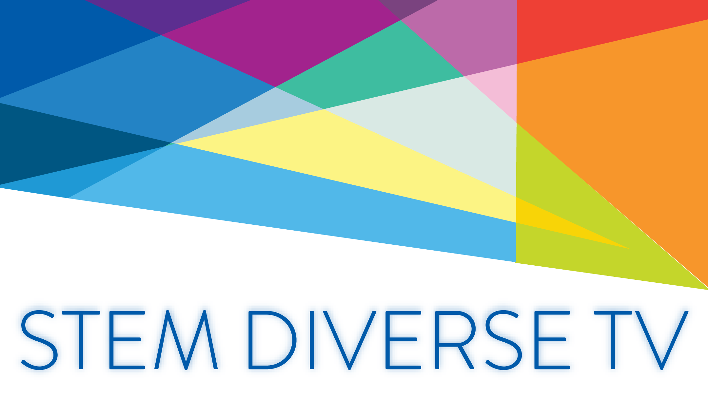

# STEM Diverse TV (AndroidTV)

STEM Diverse TV is an AndroidTV application aims to promote diversity in the field of STEM by inspiring women so as to leverage their interest in the field.

To run the development environment for this frontend, you need [Git](https://git-scm.com/) and [Android Studio](https://developer.android.com/studio) installed.

## Table of contents

- [STEM Diverse TV (AndroidTV)](#stem-diverse-tv-androidtv)
    - [Table of contents](#table-of-contents)
    - [Project Setup](#project-setup)
    - [Troubleshooting your local environment](#troubleshooting-your-local-environment)
    - [Branches](#branches)
    - [Contributing](#contributing)
    - [Contact](#contact)
    - [License](#license)

    

## Project Setup

Make sure you have the latest version of [Android Studio](https://developer.android.com/studio) installed. We strongly recommend you to update all the libraries and sync the project(might take a minute).

In order to setup the project locally just follow the steps described below:

 - Fork the project repository then clone your fork to your system.
 - Open the project using Android Studio
 - You have successfully set up the application.
 
## Troubleshooting your local environment

Always `git pull` and get the latest from master. [Google](https://www.google.com) and [Stackoverflow](https://stackoverflow.com/) are your friends. You can find answers for most technical problems there. If you run into problems you can't resolve, feel free to open an issue.

## Branches

* **master** This contains the code which has been deployed into production.

 * **develop** This contains the latest code. All the contributing PRs must be sent to this branch. When we want to release the next version of the app, this branch is merged into the `master` branch.

## Contributing

Please read our [Contributing guidelines](.github/CONTRIBUTING.md), [Code of Conduct](.github/CODE_OF_CONDUCT.md) and [Reporting Guidelines](http://systers.io/reporting-guidelines)

Please follow our [Commit Message Style Guide](https://github.com/anitab-org/stem-diverse-android-tv/wiki/Commit-Message-Style-Guide) and [Pull Request Template](.github/PULL_REQUEST_TEMPLATE.md) while creating Pull Requests.

### Best practices

1. Try to do a root cause analysis for the issue, if applicable.
2. Reference the issue being fixed in the corresponding PR.
3. Use meaningful commit messages in a PR.
4. Use one commit per task. Do not over commit (add unnecessary commits for a single task) or under commit (merge 2 or more tasks in one commit).
5. Add screenshot/short video in case the changes made in the PR, are being reflected in the UI of the application.
6. Close the issue as soon as the corresponding PR is accepted/closed.

### Some don'ts

1. Send a MR without an existing issue.
2. Fix an issue assigned to somebody else and submit a PR before the assignee does.
3. Report issues which are previously reported by others. (Please check both the open and closed issues).
4. Suggest unnecessary or completely new features in the issue list.
5. Add unnecessary spacing or indentation to the code.

## Contact

Have a query, feel free to reach out to our team on our Zulip channel [#STEM-diverse-tv](https://anitab-org.zulipchat.com/login/#narrow/stream/225705-STEM-diverse-tv) where all the discussion on this project are carried out.

## License

STEM Diverse TV is licensed under the GNU General Public License v3.0. Learn more about it in the [LICENSE](LICENSE) file.
